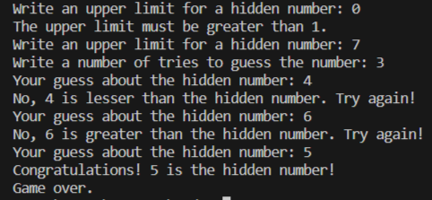
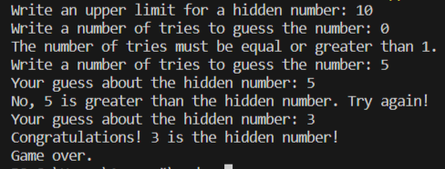

# Applied Coding 10
## Исполнитель    
Фадеев Алексей    
группа ФТ-220007    
## Лабораторная работа №10    
Компьютер загадывает число от 1 до N. У пользователя k попыток отгадать. После каждой неудачной попытки компьютер сообщает меньше или больше загаданное число. В конце игры текст с результатом (или «Вы угадали», или «Попытки закончились»).
Написать на любом языке программу, реализующую данную задачу.    
Код программы должен содержать комментарии для созданных функций и основных блоков, а также качественный диалог с пользователем для минимизации отказов при неправильном вводе.    
## Среда разработки    
Язык программирования: Python.    
Среда разработки: Visual Studio Code.    
## Инструкция по работе    
Входные данные: натуральные числа N и k.    
Выходные данные: ответ на попытку ввода, ответ в конце игры.    
## Тесты    
Тест 1    
    
Тест 2    
    
